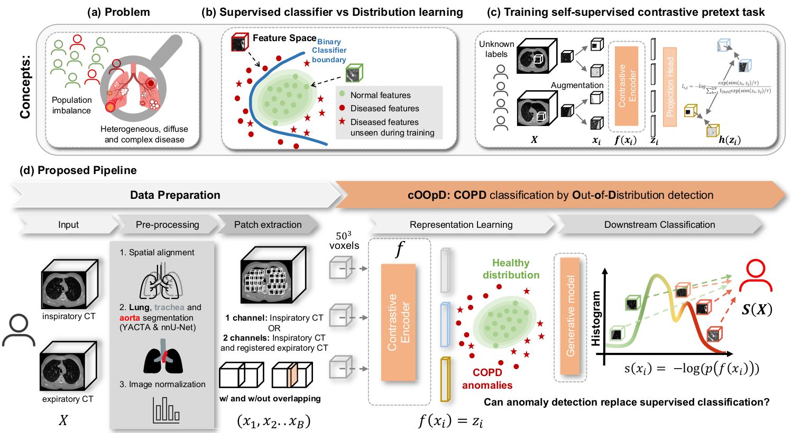
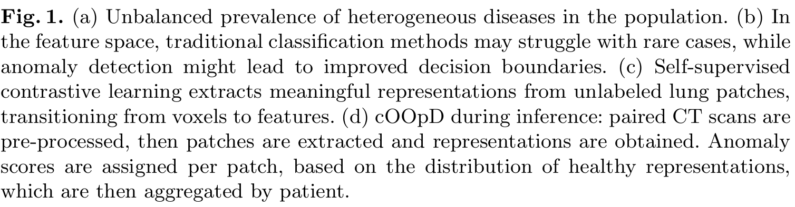

# cOOpD

> Reformulating COPD classification on chest CT scans as anomaly detection using contrastive representations
>
> Official Code Repository Going alongside the Paper


## Table of Contents
- [cOOpD](#cradl)
  - [Table of Contents](#table-of-contents)
  - [General Information](#general-information)
  - [Technologies Used](#technologies-used)
  - [Features](#features)
  - [Setup](#setup)
    - [Running with new datasets](#running-with-new-datasets)
    - [Changing the generative models on the latent space](#changing-the-generative-models-on-the-latent-space)
  - [Usage](#usage)
  - [Project Status](#project-status)
  - [Room for Improvement](#room-for-improvement)
  - [Acknowledgements](#acknowledgements)
  - [License](#license)


## General Information
Official PyTorch implementation for paper **_cOOpD: Reformulating COPD classification on chest CT scans as anomaly detection using contrastive representations_**
, accepted in MICCAI 2023.
Paper linked here soon.




## Abstract
Classification of heterogeneous diseases is challenging due to their complexity, variability of symptoms and imaging findings. Chronic
Obstructive Pulmonary Disease (COPD) is a prime example, being underdiagnosed despite being the third leading cause of death. Its sparse,
diffuse and heterogeneous appearance on computed tomography challenges supervised binary classification. We reformulate COPD binary
classification as an anomaly detection task, proposing cOOpD: heterogeneous pathological regions are detected as Out-of-Distribution (OOD)
from normal homogeneous lung regions. To this end, we learn representations of unlabeled lung regions employing a self-supervised contrastive
pretext model, potentially capturing specific characteristics of diseased and healthy unlabeled regions. A generative model then learns the distribution of healthy representations and identifies abnormalities (stemming
from COPD) as deviations. Patient-level scores are obtained by aggregating region OOD scores. We show that cOOpD achieves the best performance on two public datasets, with an increase of 8.2% and 7.7% in
terms of AUROC compared to the previous supervised state-of-the-art.
Additionally, cOOpD yields well-interpretable spatial anomaly maps and
patient-level scores which we show to be of additional value in identifying
individuals in the early stage of progression. Experiments in artificially
designed real-world prevalence settings further support that anomaly detection is a powerful way of tackling COPD classification. Code will be
released upon acceptance.
## Technologies Used
- Python - version 3.7+
- See requirements.txt
- [FrEIA Framework](https://github.com/VLL-HD/FrEIA)


## Features
Contrastive Pretext Training on Medical Data 


## Setup
Set this up with conda:
```
$ conda create -n cradl python=3.7
$ pip install -r requirements.txt
```


**Pre-processing**

Follow the instructions [[here]([README_preprocessing.md](pre-process%2FREADME_preprocessing.md))]


Set all the paths to the data and logs in: 
- config/global_config
- config/datasets/brain.py
- create own datamodule carrying your data 
  - see --> datamodules/brain_module.py \& atamodules/brain.py

Verify that everything is working
```
$ python train_pretext.py --fast_dev_run True
```
See in the logs folder, whether a log has been created,
access with tensorboard via:
```
$ tensorboard --path {path_to_logs}
```

Fitting of the generative models
```
$ python train_latent_gen.py -p {path_to_experiment}
```

Evaluation of the generative models
```
$ python eval.py -p {path_to_experiment}
```

### Running with new datasets 
To run experiments with new datasets:
1.  Add a new datamodule
2.  Add a new option for `get_data_loaders(name_exp)` in `eval.py`

### Changing the generative models on the latent space
To do this, add a new entry to the dictionary in the file `config/latent_model.py`.

## Usage
Anomaly Detection with the cOOpD framework on 3D data.


## Project Status
Project is _in progress_


## Acknowledgements
CRADL: Contrastive Representations for Unsupervised Anomaly Detection and Localization [[link]](https://arxiv.org/abs/2301.02126) 

## License 
